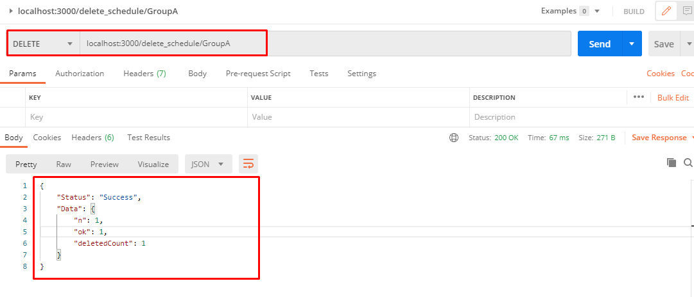

# BigApp-Email-Scheduling App
Simple API to schedule emails and send them, API's we can use to add new schedules, Update exixting schedule, delete and also we can use to list all scedules 

# Configuration needed
 1. Need to install node modules
 2. Add **.env** file with neccesory details
    a. PORT
    b. SMTP_HOST
    c. SMTP_USER
    d. SMTP_PASSWORD

# Start Application to
To start application use **npm run start** command and to schedule use **npm run mail_cron** command

# Project Repository Structure

# Screenshots

## Deliverd Email

**Create Schedule API Response**

**Created Schedule In Database**

## Different API Response

**Read Schedules**

**list Schedules**

**Update Schedules**

**Delete Schedules**

**API to list all failed or success Mails**

**List of all Mail Sent status either failed or success**

